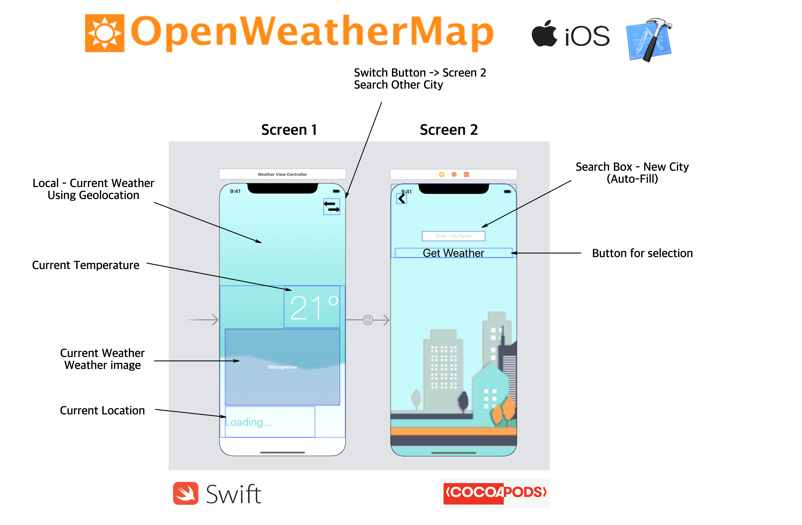

# Weather App

## My Goal

Develop a iOS Weather App

Weather is a location-aware weather app. It will find out where you are in the world and query an open source weather service to retrieve the temperature and weather conditions. Also, you can change the city at the tap of a button. Want to know what it’s like in Victoria? Weather is here to help. 

## What I will create

I purpose a weather app using the Openweathermap weather API. The main page uses geo
location to bring up the users local weather. The user can use switch button to migrate to
screen and select new city. The intended Audience is anyone that is interested in the current
weather. By bringing up the app you get the current weather instantly.
Screens
1. On Launch - location based weather screen
* get Geolocation and send to Openweathermap weather API to acquire local weather data using my API Key
* Displays Current Temperature and Weather Condition (Image)
* Possible background from Unsplash Picture API
2. Search Screen - Search different City
* Allow User to get weather in different City.
3. Weather Screen for selected City
* Displays Current Temperature and Weather Condition (Image)

## What I have learned

* How to use CocoaPods to manage and use open source code libraries. 
* How to use the Command Line on Mac with Terminal.
* Learn about Networking calls.
* Use public web-based APIs to fetch data.
* How to parse data organised in JSON format.
* Learn about Core Location and utilising the iPhone’s inbuilt GPS. 
* Learn about navigation between View Controllers using Segues.
* Introduction to Delegates and Protocols.
* How to pass data between View Controllers.
* Learn and use Switch statements

